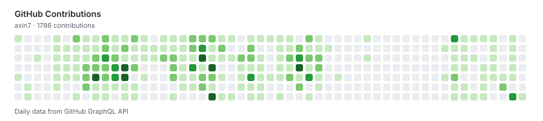

# Feng Xin

## Hero

Building calm AI tools for real life. 
做真正能进入日常生活的、安静但有力量的 AI 工具。

独立开发者 / AI 产品经理 / 上海

- 方向：AI 产品、工作流自动化、知识与信息管理
- 关键词：Calm AI、Developer Tools、Workflow Design
- 偏好：长期主义、低打扰、真实场景优先

## How I Think

- 从真实问题出发，再决定 AI 应该出现在哪里。
- AI 应该嵌进已有工作流，而不是强迫用户适应新流程。
- 我更偏好耐用、可维护、低摩擦的工具，而不是一次性的演示品。
- 产品判断和工程约束应该一起工作，持续收敛复杂度。

## Selected Work

- [fengxin.me](https://fengxin.me) — 个人网站与长期思考
- [Anyveo](https://anyveo.com) — 围绕日常场景的 AI 产品实验
- [HelloHR](https://hellohr.anyveo.com) — 面向人力场景的助手产品

## Activity

以下热力图基于 GitHub 真实贡献数据生成，通过 GitHub Actions 每日自动更新。

